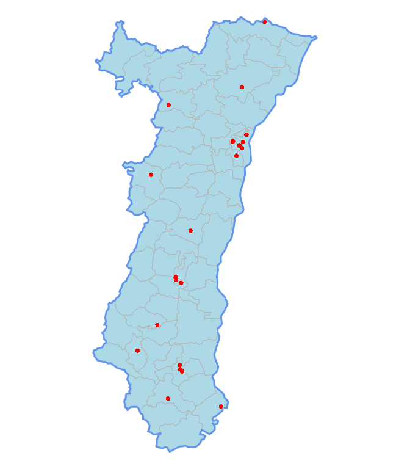

# Hôpitaux d'Alsace
JcB - RESURAL  
10/01/2016  


```r
file <- "../Cartofile/Hopitaux_Alsace.csv"
hop <- read.csv(file)

names(hop)
```

```
##  [1] "HOPITAL"    "REGION"     "NO_REGION"  "DEP"        "LONG"      
##  [6] "LAT"        "LAMB93_X"   "LAMB93_Y"   "RPU_NAME"   "FINESSG"   
## [11] "FINESSJ"    "GROUPE"     "TERRITOIRE" "ZONEP"      "TYPE"      
## [16] "STATUT"     "SU"         "UNV"        "USIC"       "LITS_TOT"  
## [21] "LITS_MED"   "LITS_CHIR"  "LITS_REA"   "URG_JOUR"   "COMPETENCE"
## [26] "SOURCE"
```
Transformation de hop en SpatialPointsDataFrame
-----------------------------------------------
On crée l'objet à partir des colonnes LONG et LAT donc implicitement au format WSG84 et on l'enregistre au format SHP.

```r
library(sp)
library(rgdal)
```

```
## rgdal: version: 1.1-3, (SVN revision 594)
##  Geospatial Data Abstraction Library extensions to R successfully loaded
##  Loaded GDAL runtime: GDAL 1.11.2, released 2015/02/10
##  Path to GDAL shared files: /usr/share/gdal/1.11
##  Loaded PROJ.4 runtime: Rel. 4.8.0, 6 March 2012, [PJ_VERSION: 480]
##  Path to PROJ.4 shared files: (autodetected)
##  Linking to sp version: 1.2-1
```

```r
coordinates(hop) = ~ LONG + LAT
proj4string(hop) = CRS("+proj=longlat +datum=WGS84")
# writeOGR(hop, "../Cartofile/HopAlsWSG84", "hopalsWsg", "ESRI Shapefile")
```

Reprojection de la couche au format Lambert 93
----------------------------------------------

L'objet hop est transformé dans le référentiel Lambert 93 pour être compatible avec les cartes IGN. Le nouvel objet est sauvegardé au format Shapefile et Rda. On peut ouvrir le Shapefile avec QGis et le Rda avec R. Les sauvegardes sont neutralisées pour ne pas modifier accidentellement les fichiers.


```r
# EPSG:2154 Lambert 93
newProj = CRS("+proj=lcc +lat_1=49 +lat_2=44 +lat_0=46.5 +lon_0=3 +x_0=700000 +y_0=6600000 +ellps=GRS80 +towgs84=0,0,0,0,0,0,0 +units=m +no_defs")
newHop <- spTransform(hop, newProj)
# writeOGR(newHop, "../Cartofile/HopAlsLamb93", "hopalsL93", "ESRI Shapefile")

hop93 <- newHop
# save(hop93, file = "../Cartofile/hop93.Rda")
```

Affichage de la carte de l'Alsace avec les hôpitaux
---------------------------------------------------


```r
par(mar = c(0,0,0,0))
load("../Cartofile/contour_cantons_alsace.Rda")
load("../Cartofile/contour_region_als.Rda")
plot(contour.cantons.als, col = "lightblue", border = "gray70")
plot(hop93, pch = 16, col = "red", add = TRUE)
plot(contour.region.als, border = "cornflowerblue", lwd = 3, add = TRUE)
```

 

